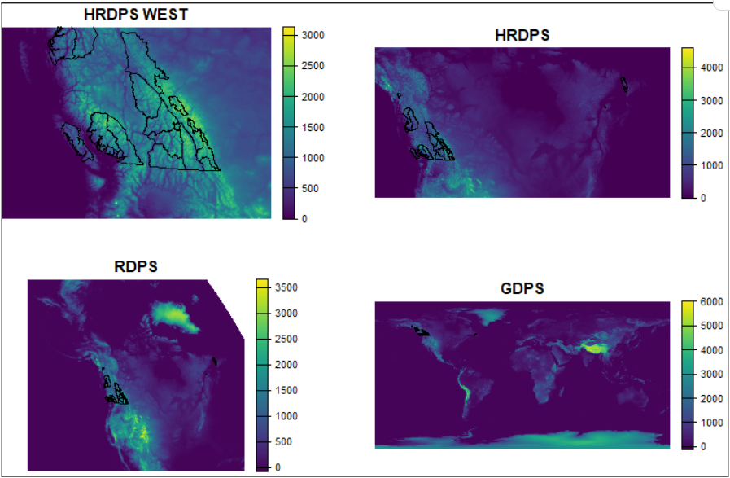

# NWP archives by AvCan/SARP

## Overview

We maintain an archive of NWP data from several ECCC models. These datasets were downloaded from the MSC Datamart and then resampled to produce one file per day with the data needed to run SNOWPACK. The following models and years are archived:

- **HRDPS** (2013-2023, 2025)
- **RDPS** (2020-2022)
- **GDPS** (2020-2022)
- **REPS** (2022)

## Model grids

The topographies are defined in the following files:

| File | Years | Grid Size | Projection |
|------|-------|-----------|------------|
| `HRDPS_WEST_DEM.grib2` | 2013 - 2017 | 485 x 685 | polar stereographic |
| `HRDPS_OLD_DEM.grib2` | 2017 - 2023 | 1456 x 2576 | polar stereographic |
| `RDPS_OLD_DEM.grib2` | 2020 - 2024 | 824 x 935 | polar stereographic |
| `HRDPS_DEM.grib2` | 2023 - current | 1290 x 2540 | rotated latlon |
| `RDPS_DEM.grib2` | 2025 - current | 1076 x 1102 | rotated latlon |
| `GDPS_DEM.grib2` | 2020 - 2022 | 751 x 1500 | latlon |




## Fir archives

### Available data

HRDPS archives are resampled into one GRIB file per day (**bold rows are not yet processed**). RDPS, GDPS, and REPS have not been resampled into the same format as HRDPS.

Raw data is resampled with `wgrib2` to:
- Select specific timesteps (predictive hours 7 to 12)
- Backfill missing data with earlier runs
- Convert units
- Unaccumulate precipitation and radiation
- Change compression from JPEG to complex3 (larger files but much faster read time)

**File size**: HRDPS_WEST (70 MB/d, 20 GB/season), HRDPS (1 GB/d, 250 GB/season)

### Season archive status

| Season | Start | End | Grid | Notes |
|--------|-------|-----|------|-------|
| 2013 | 2012-10-03 | 2013-05-01 | HRDPS_WEST | |
| 2014 | 2013-10-01 | 2014-04-29 | HRDPS_WEST | |
| 2015 | 2014-10-01 | 2015-03-31 | HRDPS_WEST | Missing RH from 2024-11-20 to 2024-11-26 |
| 2016 | 2015-09-01 | 2016-04-03 | HRDPS_WEST | Missing 6 hours on 2015-09-04 |
| 2017 | 2016-09-01 | 2017-05-01 | HRDPS_WEST | |
| 2018 | 2017-09-13 | 2018-04-30 | HRDPS_OLD | |
| 2019 | 2018-09-01 | 2019-04-30 | HRDPS_OLD | |
| 2020 | 2019-09-01 | 2020-04-30 | HRDPS_OLD | |
| 2021 | 2020-09-01 | 2021-05-31 | HRDPS_OLD | |
| 2022 | 2021-09-01 | 2022-04-30 | HRDPS_OLD | |
| 2023 | 2022-09-01 | 2023-05-31 | HRDPS_OLD | Resampled 2023-02-23 onward to HRDPS_OLD grid |
| 2024 | | | HRDPS | ACCIDENTALLY DELETED |
| 2025 | 2024-09-01 | 2025-06-01 | HRDPS | |

### Accessing data on Fir

NWP data is stored in `/project/def-phaegeli/data/nwp` (realpath = `/project/6005576/data/nwp`) with the `dem/` directory storing the grid elevations, and the `hrdps/` directory containing data in folders for each season.

Members of the `def-phaegeli` group can easily access this data.

Other members of the Alliance infrastructure need manual permission by Pascal via `setfacl`:

```bash
# Allow user to traverse the project directory (needed to reach data/nwp)
setfacl -m u:bimbach:X /project/6005576

# Allow user to traverse the data directory
setfacl -m u:bimbach:X /project/6005576/data

# Set default ACL so new files/dirs in nwp inherit read+browse permissions
setfacl -d -m u:bimbach:rX /project/6005576/data/nwp

# Apply read+browse permissions to all existing files/dirs in nwp
setfacl -R -m u:bimbach:rX /project/6005576/data/nwp
```

See the `archive2smet/` folder for examples of how to read the data with xarray and generate SMET files.

### Dataset structure

When parsed with xarray, the dataset structure is:

```
<xarray.Dataset> Size: 229MB
Dimensions:    (time: 24, y: 485, x: 685)
Coordinates:
  * time       (time) datetime64[ns] 192B 2015-02-01 ... 2015-02-01T23:00:00
    latitude   (y, x) float64 3MB ...
    longitude  (y, x) float64 3MB ...
Dimensions without coordinates: y, x
Data variables:
    TA         (time, y, x) float32 32MB ...
    DW         (time, y, x) float32 32MB ...
    VW         (time, y, x) float32 32MB ...
    RH         (time, y, x) float32 32MB ...
    ISWR       (time, y, x) float32 32MB ...
    ILWR       (time, y, x) float32 32MB ...
    PSUM       (time, y, x) float32 32MB ...
```

## Operational chain and new data

AvCan will download individual GRIB files on AWS via AMQP.

- **HRDPS**: Each model run will be resampled into a GRIB file using `wgrib2` for the operational toolchain, then daily archive files will be created by extracting forecast hours 7–12 from each run
- Other ECCC products may be downloaded for research with minimal preprocessing
- Data will be periodically transferred to Fir via Globus

## Creating SNOWPACK inputs

NWP data may be read directly using a MeteoIO plugin (GRIB, NETCDF) or with an intermediate step of writing standard SMET files (typically via Python/xarray or R/terra).

Future work will develop an NWP provider for AWSOME to directly work with these data via xarray.
